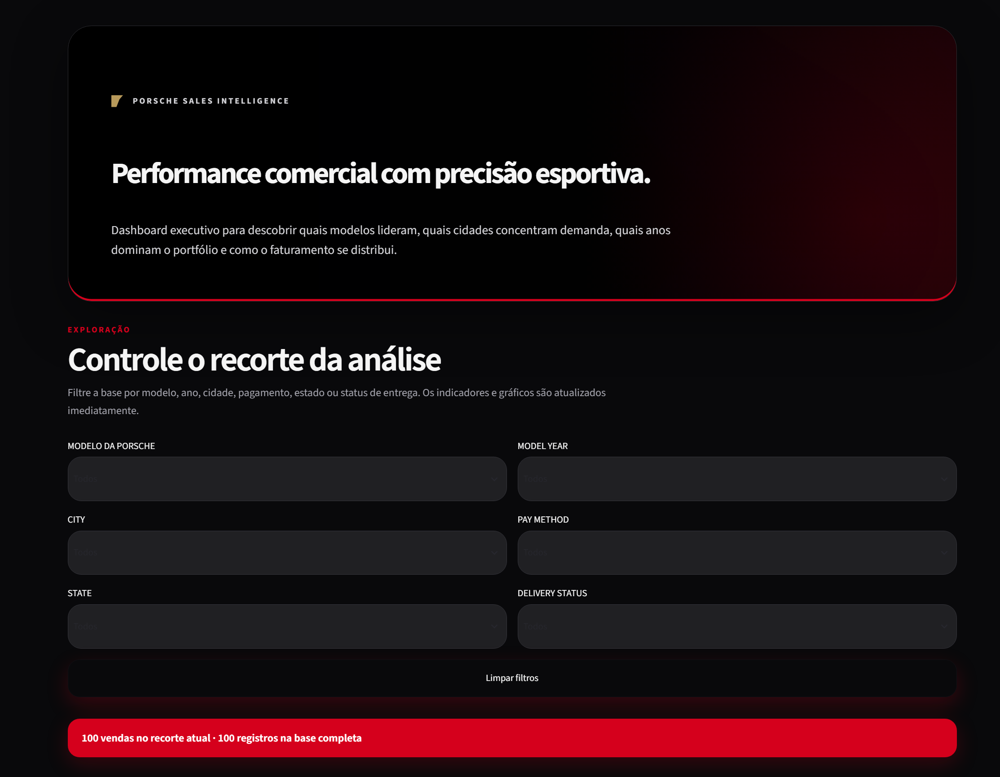
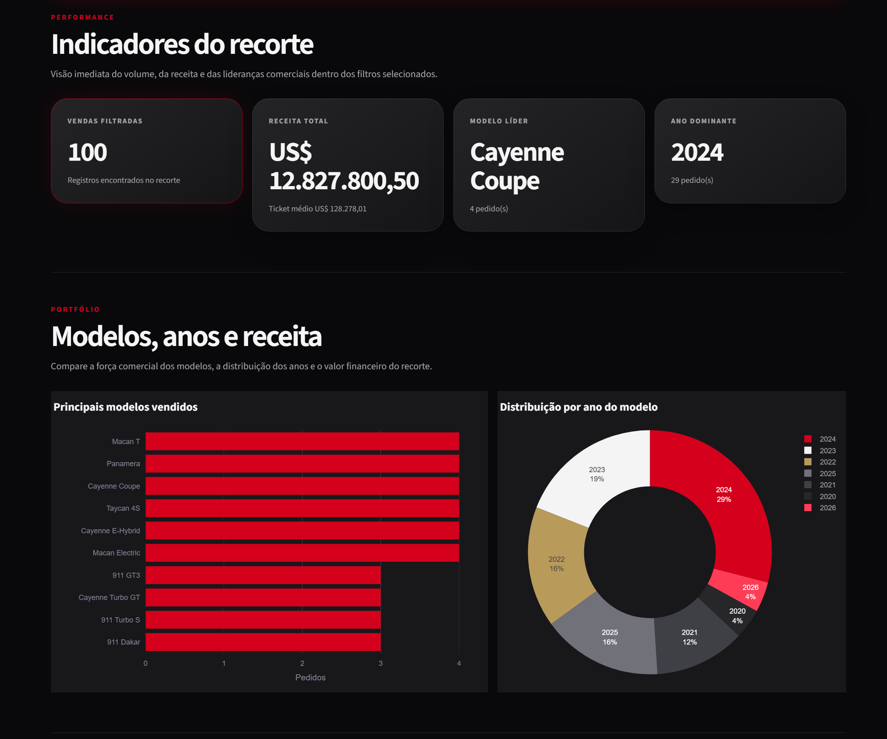
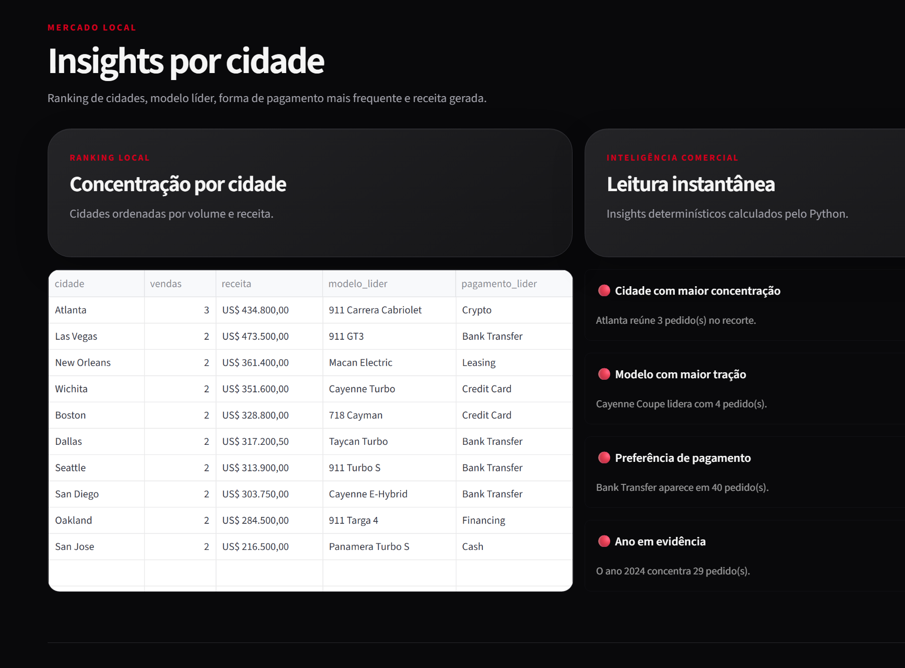
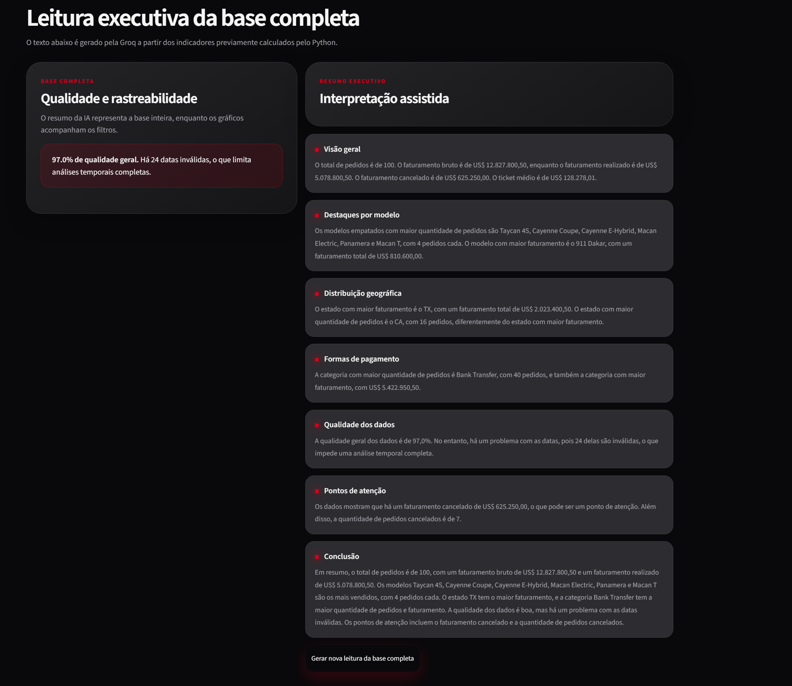
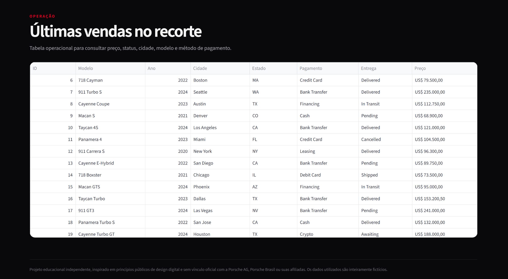

# Porsche Sales AI Agent

Agente de Inteligência Artificial desenvolvido para sanitizar, sumarizar e criar um dashboard interativo a partir de uma planilha fictícia de vendas da Porsche.

## Sobre o projeto

Este projeto foi desenvolvido como desafio prático de criação de um agente de IA capaz de trabalhar com dados provenientes de uma planilha Excel.

A solução recebe uma planilha fictícia de vendas, identifica inconsistências, padroniza os dados, calcula indicadores, gera um resumo executivo com Inteligência Artificial e apresenta os resultados em um dashboard interativo.

A arquitetura foi construída de forma que os cálculos sejam realizados por código Python, enquanto a IA atua somente na interpretação dos resultados.

## Objetivos

O projeto foi desenvolvido para:

- carregar uma planilha Excel;
- analisar sua estrutura;
- identificar problemas de qualidade;
- sanitizar datas, textos, preços e outros campos;
- preservar os dados originais;
- gerar indicadores de vendas;
- exportar os dados tratados;
- produzir um resumo executivo com IA;
- apresentar os resultados em um dashboard;
- validar regras com testes automatizados;
- documentar todas as etapas no GitHub.

## Arquitetura da solução

```text
Planilha Excel original
        ↓
Diagnóstico inicial
        ↓
Pipeline de sanitização
        ↓
Planilha sanitizada
        ↓
Relatório de qualidade
        ↓
Cálculo dos indicadores
        ↓
Resumo estruturado em JSON
        ↓
Agente de IA via Groq
        ↓
Resumo executivo
        ↓
Dashboard Streamlit
```

## Separação de responsabilidades

### Python

O código Python é responsável por:

- leitura da planilha;
- validação;
- sanitização;
- conversão de formatos;
- cálculo dos indicadores;
- geração dos arquivos processados;
- construção dos gráficos;
- execução dos testes.

### Inteligência Artificial

O agente de IA é responsável por:

- interpretar os indicadores;
- destacar padrões;
- produzir um resumo executivo;
- explicar limitações dos dados;
- apontar pontos de atenção fundamentados.

A IA não realiza os cálculos matemáticos.

## Tecnologias utilizadas

- Python 3.11
- pandas
- openpyxl
- Streamlit
- Plotly
- Groq SDK
- python-dotenv
- pytest
- Git
- GitHub

## Estrutura do repositório

```text
porsche-sales-ai-agent/
├── app.py
├── README.md
├── requirements.txt
├── .env.example
├── .gitignore
├── LICENSE
│
├── data/
│   ├── raw/
│   │   └── vendas_porsche_ficticias.xlsx
│   │
│   └── processed/
│       ├── vendas_porsche_sanitizadas.xlsx
│       ├── relatorio_qualidade.json
│       ├── resumo_indicadores.json
│       └── resumo_executivo_ia.txt
│
├── docs/
│   ├── 01-analise-inicial.md
│   ├── 02-sanitizacao.md
│   ├── 03-sumarizacao.md
│   ├── 04-dashboard.md
│   ├── 05-agente-ia.md
│   ├── 06-testes.md
│   ├── diagnostico_inicial.txt
│   └── diagnostico_cidades.txt
│
├── prompts/
│   └── resumo_executivo.md
│
├── src/
│   ├── agente_ia.py
│   ├── analisador.py
│   ├── diagnostico.py
│   └── sanitizador.py
│
└── tests/
    └── test_sanitizador.py
```

## Fluxo de execução

O projeto possui quatro etapas principais.

### 1. Diagnóstico

O arquivo:

```text
src/diagnostico.py
```

analisa a planilha original e informa:

- quantidade de abas;
- quantidade de registros;
- quantidade de colunas;
- nomes das colunas;
- tipos de dados;
- valores ausentes;
- registros duplicados;
- exemplos dos dados.

### 2. Sanitização

O arquivo:

```text
src/sanitizador.py
```

executa o tratamento dos dados e gera:

```text
data/processed/vendas_porsche_sanitizadas.xlsx
data/processed/relatorio_qualidade.json
```

### 3. Sumarização

O arquivo:

```text
src/analisador.py
```

calcula os indicadores e gera:

```text
data/processed/resumo_indicadores.json
```

### 4. Agente de IA

O arquivo:

```text
src/agente_ia.py
```

envia os indicadores e o relatório de qualidade para um modelo hospedado pela Groq e gera:

```text
data/processed/resumo_executivo_ia.txt
```

## Regras de sanitização

### Datas

Foram encontrados diferentes formatos e datas impossíveis.

Exemplos:

```text
2024-02-30
April 31st, 2024
2024-15/07
February 30th, 2027
```

As datas válidas foram convertidas.

As datas impossíveis foram marcadas como inválidas, sem correções por suposição.

Resultado:

- 76 datas válidas;
- 24 datas inválidas.

### Ano do modelo

Exemplos convertidos:

```text
20-24                     → 2024
20 23                     → 2023
twenty twenty five        → 2025
two thousand twenty one   → 2021
```

Resultado:

- 100 anos válidos.

### Preços

Exemplos convertidos:

```text
$79,500.00                → 79500.00
235000 USD                → 235000.00
USD 112.750               → 112750.00
$121k                     → 121000.00
$89.750,00                → 89750.00
eighty two thousand USD   → 82000.00
```

Resultado:

- 100 preços válidos.

### Quilometragem

Foram tratados valores em milhas, quilômetros, números por extenso e veículos novos.

Exemplos:

```text
9,800 miles             → 9800 milhas
Miles: 6,400            → 6400 milhas
KM 18,900               → 11743.91 milhas
zero miles              → 0 milhas
new car                 → 0 milhas
twelve thousand miles   → 12000 milhas
```

A unidade padronizada foi milhas.

Resultado:

- 100 quilometragens válidas.

### Formas de pagamento

As variações foram agrupadas nas seguintes categorias:

- Bank Transfer
- Credit Card
- Financing
- Cash
- Leasing
- Crypto
- Debit Card

### Cidades

Foram corrigidos espaços e capitalização.

Exemplos:

```text
atlanta            → Atlanta
colorado springs   → Colorado Springs
san francisco      → San Francisco
```

Resultado:

- 100 cidades válidas;
- 30 valores alterados.

### Estados

Nomes completos e siglas foram padronizados para duas letras em maiúsculas.

Exemplos:

```text
California        → CA
california        → CA
tx                → TX
North Carolina    → NC
```

Resultado:

- 100 estados válidos.

### Status de entrega

As variações foram agrupadas nas categorias:

- Delivered
- Pending
- In Transit
- Awaiting
- Cancelled
- Shipped

Exemplos:

```text
delivered!!!      → Delivered
DELIVERD          → Delivered
pending approval  → Pending
in-transit        → In Transit
```

## Qualidade dos dados

Foram realizadas 800 validações:

```text
100 registros × 8 campos avaliados
```

Resultado:

- 776 validações aprovadas;
- 24 validações inválidas;
- qualidade geral de 97%.

A métrica representa o percentual de validações aprovadas e não significa que 97% dos registros estejam integralmente perfeitos.

## Indicadores encontrados

### Indicadores gerais

- Total de pedidos: 100
- Faturamento bruto: US$ 12.827.800,50
- Faturamento realizado: US$ 5.078.800,50
- Faturamento cancelado: US$ 625.250,00
- Ticket médio: US$ 128.278,01
- Menor venda: US$ 58.900,00
- Maior venda: US$ 286.500,00
- Vendas entregues: 41
- Vendas canceladas: 7

### Modelos mais vendidos

Houve empate entre seis modelos, com 4 pedidos cada:

- Taycan 4S
- Cayenne Coupe
- Cayenne E-Hybrid
- Macan Electric
- Panamera
- Macan T

### Modelo com maior faturamento

```text
911 Dakar
US$ 810.600,00
```

### Estado com maior faturamento

```text
TX
US$ 2.023.400,50
```

A Califórnia teve maior quantidade de pedidos, mas faturamento menor que o Texas.

### Forma de pagamento com maior faturamento

```text
Bank Transfer
40 pedidos
US$ 5.422.950,50
```

## Agente de IA

O agente usa a GroqCloud e o modelo:

```text
llama-3.3-70b-versatile
```

O prompt utilizado está disponível em:

```text
prompts/resumo_executivo.md
```

O agente recebe apenas:

- indicadores calculados;
- relatório de qualidade;
- instruções do prompt.

A planilha completa não precisa ser enviada ao modelo.

## Evolução do prompt

A primeira versão do prompt permitiu conclusões excessivamente subjetivas, como:

- classificação do desempenho;
- sugestões de mudanças sem evidência;
- menção a perdas;
- omissão de parte dos modelos empatados.

O prompt foi ajustado para:

- proibir recálculos;
- evitar informações inventadas;
- impedir atribuição de causas;
- exigir todos os modelos empatados;
- diferenciar pedidos e entregas;
- destacar limitações;
- reduzir conclusões subjetivas.

A temperatura do modelo foi configurada em:

```text
0.0
```

Isso reduz a variabilidade e a criatividade desnecessária.

## Dashboard

O dashboard foi desenvolvido com Streamlit e Plotly.

Ele exibe:

- indicadores gerais;
- resumo executivo com IA;
- qualidade dos dados;
- análise por modelo;
- análise por estado;
- formas de pagamento;
- tabela completa dos dados sanitizados;
- botão para gerar um novo resumo.

O dashboard continua funcionando mesmo quando a API da Groq está indisponível.

## Capturas do dashboard

### Visão geral e filtros



### Indicadores e portfólio



### Mercado local



### Leitura executiva com IA



### Operação e rastreabilidade



## Instalação

### 1. Clone o repositório

```bash
git clone https://github.com/ludperim/porsche-sales-ai-agent.git
```

### 2. Entre na pasta

```bash
cd porsche-sales-ai-agent
```

### 3. Crie o ambiente virtual

No Windows:

```bash
python -m venv .venv
```

### 4. Ative o ambiente virtual

No Prompt de Comando:

```cmd
.venv\Scripts\activate
```

No Git Bash:

```bash
source .venv/Scripts/activate
```

### 5. Instale as dependências

```bash
pip install -r requirements.txt
```

## Configuração da Groq

Crie o arquivo:

```text
.env
```

Use como base o arquivo:

```text
.env.example
```

Configure:

```env
GROQ_API_KEY=sua_chave_da_groq
```

A chave real nunca deve ser enviada ao GitHub.

## Execução

### Diagnóstico da planilha

```bash
python src/diagnostico.py
```

### Sanitização

```bash
python src/sanitizador.py
```

### Cálculo dos indicadores

```bash
python src/analisador.py
```

### Geração do resumo com IA

```bash
python src/agente_ia.py
```

### Dashboard

```bash
streamlit run app.py
```

A aplicação será disponibilizada normalmente em:

```text
http://localhost:8501
```

## Testes automatizados

Execute:

```bash
python -m pytest
```

Resultado obtido:

```text
16 passed
```

Os testes validam:

- anos;
- preços;
- quilometragens;
- formas de pagamento;
- estados;
- cidades;
- status de entrega;
- valores ausentes.

## Segurança

O projeto não publica credenciais.

Arquivos protegidos pelo `.gitignore`:

```text
.env
.env.*
.streamlit/secrets.toml
```

O arquivo `.env.example` pode ser versionado porque não contém chaves reais.

## Resiliência

A aplicação não depende da IA para calcular ou exibir os indicadores.

Mesmo sem acesso à Groq, continuam disponíveis:

- sanitização;
- planilha tratada;
- relatório de qualidade;
- indicadores;
- gráficos;
- tabela dos dados.

A IA é utilizada apenas como camada de interpretação.

## Limitações

- 24 datas inválidas impedem uma análise temporal completa;
- números por extenso são tratados por regras limitadas ao escopo;
- algumas categorias dependem de decisões de negócio;
- o agente depende da disponibilidade da Groq;
- a faixa gratuita da API possui limites;
- o texto gerado pode apresentar pequenas variações;
- o resumo de IA não substitui uma análise humana especializada.

## Documentação detalhada

A documentação passo a passo está disponível na pasta `docs`:

1. [Análise inicial](docs/01-analise-inicial.md)
2. [Sanitização](docs/02-sanitizacao.md)
3. [Sumarização](docs/03-sumarizacao.md)
4. [Dashboard](docs/04-dashboard.md)
5. [Agente de IA](docs/05-agente-ia.md)
6. [Testes automatizados](docs/06-testes.md)

## Licença

Este projeto está licenciado sob a licença MIT.